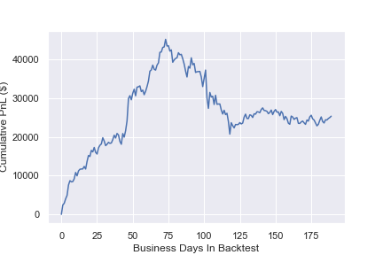
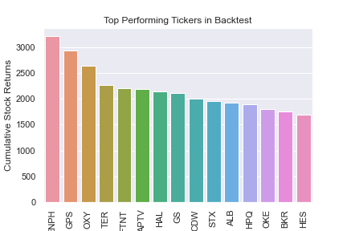
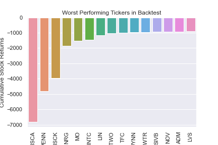
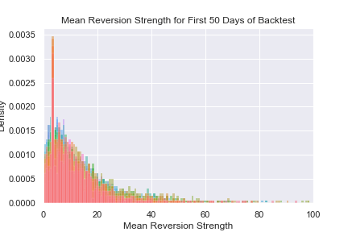
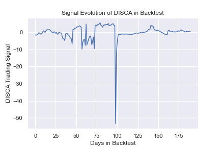
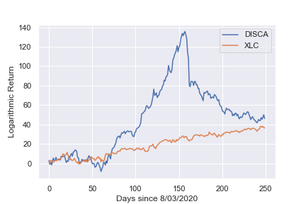
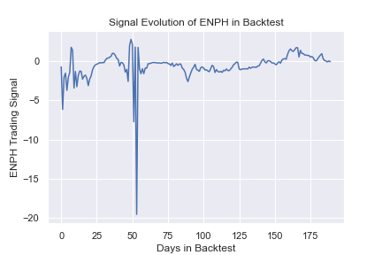
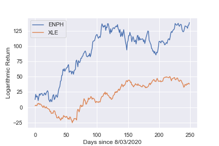

# statarb 
An implementation of a statistical arbitrage model, done on jupyter notebook. Based on Avendella, Lee 2008. 

### Notes
- Only SP500 Stocks are used (with stocks that have less than 1 year of data exluded), although a larger stock universe should be used
- ETF returns are used as market factors, but could be easily replaced by another multi-factor model such as PCA
- Different signal parameters are used than described in Avendella, in order to lean more towards long positions than short positions 
- 1 year of backtest data is used (August 3rd, 2020 - August 3rd, 2021)
- Backtests start at day 60 in the data, as the estimation window is 60 days to account for 2 earnings cycles
- The model is given $300,000 to simulate in backtest. This is to emulate a 130/30 fund with $1,000,000 in a market-wide index ETF such as SPY. The actual returns for this model would be the SP500 return + model returns, but the jupyter notebook focuses on the model return.
- This model assumes frictionless transactions. 

### An Overview of Statistical Arbitrage

As described by Avendella 2008, we assume that every stock in the trading universe has returns that follow the regression model:

    

Where:

-  is a stock's individual/idiosyncratic return 
-  are returns from a market portfolio  projected by some market factors  . Note that each stock has differing projections from these market factors. 

Assuming that market returns and a stock's idiosyncratic return are uncorrelated, we can isolate the idiosyncratic return of each stock by taking a opposing position 
in the market portfolio, such that the overall portfolio remains both dollar neutral and market neutral. Because we use only SP500 stocks as a trading universe, in practice the market portfolio is either $SPY or a corresponding industry ETF. This is referred to by generalized pairs trading, where instead of entering pairs trades between individual stocks, we enter positions against market portfolios. 

### Results and Findings 
- Two of the worst performing stocks, DISCK and DISCA, had unforeseen volatility due to the collapse of Archegos Capital Management in March 2021. VIAC, which was also part of Archegos's portfolio, had positive returns in our model. 
- Total Return: $25,359.38
- Percentage Return: 8.45%
- Sharpe Ratio: 1.5125

- Best and worst performers out of all 501 Stocks

- Mean reversion strength distribution, where 1/k gives mean reversion time

- Signal Evolution for DISCA

- Signal Evolution for ENPH

### TODO
- Add portfolio weighting optimization, such that faster mean reverting stocks are chosen over slower reverting stocks. 
- Possibly connect to IBKR to test on live data
- Fix bugs relating to negative stock beta, which shouldn't be possible

 

